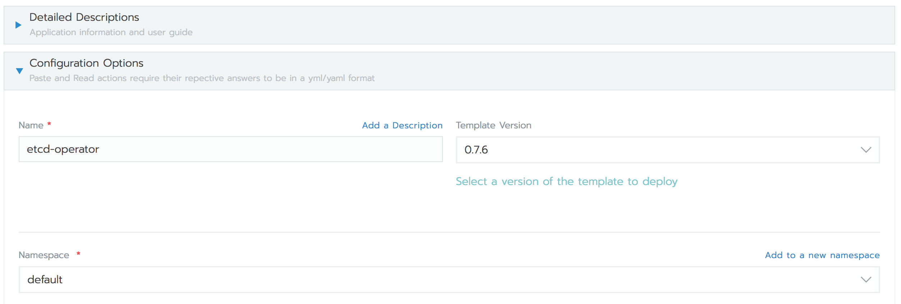

# **Using Vitess on Kuberenetes with Rancher 2.0**

### A Vitess overview

[Vitess](https://vitess.io/) is a database solution for deploying, scaling and managing large clusters of MySQL instances. It's architected to run as effectively in a public or private cloud architecture as it does on dedicated hardware. It combines and extends many important MySQL features with the scalability of a NoSQL database.

In a simple scenario with Relational Databases and MySQL in particular, you would have a master instance, then a couple of replicas. You would then direct read-only queries to the replicas and write queries (and possible critical read queries) to the master instance. Similar to the setup in the image below:


This all works fine, until you hit a limit:
- when your hardware doesn't cope with the load and you need a more expensive hardware;
- you need to manually shard the database;
- cluster management becomes a growing pain;
- query monitoring is increasingly difficult.

These are the same problems engineers at youtube dealt with, and they came up with **Vitess** to solve these problems. Fortunately for us, they made it open source, so everyone can benefit from it.
Now you'll see a lot of features of Vitess, that will seem like a list of buzzwords, but in this case, they are actually true:
- **Performance**
  - Connection pooling - Multiplex front-end application queries onto a pool of MySQL connections to optimize performance.
  - Query de-duping – Reuse results of an in-flight query for any identical requests received while the in-flight query was still executing.
  - Transaction manager – Limit number of concurrent transactions and manage deadlines to optimize overall throughput.
- **Protection**
  - Query rewriting and sanitization – Add limits and avoid non-deterministic updates.
  - Query killer – Terminate queries that take too long to return data.
  - Table ACLs – Specify access control lists (ACLs) for tables based on the connected user.
- **Monitoring**
  - Performance analysis: Tools let you monitor, diagnose, and analyze your database performance.
  - Query streaming – Use a list of incoming queries to serve OLAP workloads.
  - Update stream – A server streams the list of rows changing in the database, which can be used as a mechanism to propagate changes to other data stores.
- **Topology Management Tools**
 - Master management tools (handles reparenting)
 - Web-based management GUI
 - Designed to work in multiple data centers / regions
- **Sharding**
 - Virtually seamless dynamic re-sharding
 - Vertical and Horizontal sharding support
 - Multiple sharding schemes, with the ability to plug-in custom ones

It can be clearly seen that, at scale, the above features become incredibly valuable and necessary.

**Now, let's try it out :)**

Vitess has come a long way and now it is relatively easy to deploy a Vitess cluster with Kubernetes.

The plan is as follows:
- deploy a Rancher 2.0 instance and use it for every deploy step in this article;
- using Rancher 2.0, create a Kubernetes cluster;
- deploy Vitess on the above Kubernetes cluster;
- create a database on Vitess and query it;
- deploy a test application in the same Kubernetes cluster, that will use Vitess;

You should be able to create all the resources needed for the outlined steps with a free trial from Google Cloud Platform. A trial from GCP has a limit of 8 cores per project, keep that in mind when deploying your resources.

### Deploy a Rancher 2.0 instance and start a Kubernetes Cluster

There's already a good guide on how to deploy a Rancher 2.0 instance [here](https://rancher.com/quick-start/), thus let's not get into many details here. One note - if you want to run this guide on Google Cloud Platform trial, then create a separate project for the Rancher instace, thus saving yourself a CPU core for the Kubernetes cluster (remember the 8 cores limit per project for the GCP trial ;) ?)

Now onto starting a Kubernetes Cluster. For this, there's again a pretty good guide [here](https://rancher.com/docs/rancher/v2.x/en/cluster-provisioning/hosted-kubernetes-clusters/gke/). One note - Vitess documentation recommends a cluster of 5 `n1-standard-4` instances, that will get you over the GCP trial limit. But, if you create a 4 nodes of `n1-standard-2` type, this will get you exactly to the 8 cores limit per project for GCP trial and it's enough for the outlined tasks. There will be some changes to the Vitess scripts, to deploy less resources, so you can fit needed resources into the smaller cluster.

The `Create Cluster` part from Rancher should look like in the below image:


#### Start a Vitess control pod

Note the name of the cluster `vitess-demo`, it will be referenced further. Once you have your cluster created and active the first thing to do is to create a control instance, where you will have all the necessary tools for this Vitess demo. To do that, go to your newly created `vitess-demo` cluster, onto to the `Default` project and click on `Deploy`. Fill in there the details:
- set the `Name` to `vitess-control`;
- set the docker image to `golang`;
- leave everything else as it is.
It should look like in the below image:


Click confidently on `Launch`!

In a moment you should have your `vitess-control` pod running. It will be used as a control plane for your Vitess cluster and **thanks to Rancher, you will be able to access it from anywhere you have an internet access and a browser.**

Ok, let's get to installing the control part. To do that, click on the right hand side menu of `vitess-control` pod and select `Execute shell`, just like in the screenshot below:


#### Build, install vtctlclient and configure settings

This will bring you the go command line that we need. Let's start typing commands there. First build and install `vtctlclient` by running:

```
go get vitess.io/vitess/go/cmd/vtctlclient
```

When successfull, this command doesn't provide any output and it will download and build Vitess source code at this location: `$GOPATH/src/vitess.io/vitess/`, it will also copy the built `vtctlclient` binary to `$GOPATH/bin`.

Now let's navigate to the Vitess source code directory and configure site-local settings with the following commands:

```
cd $GOPATH/src/vitess.io/vitess/examples/kubernetes
./configure.sh
```

It should look as below:


At the moment Vitess has out-of-the-box support for backups in Google Clous Storage. If you want, you can create a bucket in Google Cloud to test the backup in this demo, but it's not very important for the demo purposes.

There will also be a need to have `kubectl` configured on the `vitess-control` instance, to interact directly with the cluster. To do this, run the following commands on the `vitess-control` command line:

```
curl -LO https://storage.googleapis.com/kubernetes-release/release/$(curl -s https://storage.googleapis.com/kubernetes-release/release/stable.txt)/bin/linux/amd64/kubectl
chmod +x ./kubectl
mv ./kubectl /usr/local/bin/kubectl
```

Now you need the kubeconfig file, that you can get from Rancher. You can get that from the `vitess-demo` default dashboard. On the upper right corner you should see `Launch kubectl` and `Kubeconfig file`. Click on `Kubeconfig file` and you'll be presented with the contents of the kubeconfig file. On the bottom you will have the `Copy to Clipboard` option, click on that. Now you need to paste it into `~/.kube/config` file inside `vitess-control` instance. To do that, execute shell in `vitess-control` instance and issue the below commands there:

```
apt-get update
apt-get install -y vim
vim ~/.kube/config
```

Once you opened the file with vim, paste the kubeconfig file inside that file (don't forget to enter insert mode in vim, by just pressing the I key, before pasting the contents).

Confirm that you have kubectl working properly, by issuing the following command:

```
root@vitess-control-fdb84cbc4-xgq75:/go# kubectl get pod
NAME                             READY     STATUS    RESTARTS   AGE
vitess-control-fdb84cbc4-xgq75   1/1       Running   0          55m
root@vitess-control-fdb84cbc4-xgq75:/go#
```

You should see the only pod running, the exact one from which you're running the commands - `vitess-control`

#### Start Vitess etcd cluster

The Vitess [topology service](https://vitess.io/overview/concepts/#topology-service) stores coordination data for all the servers in a Vitess cluster. It can store this data in one of several consistent storage systems. In this example, we'll use etcd. This will require a separate etcd cluster, from the Kubernetes one.

To easily create an etcd cluster, let's install `etcd-operator`, using Rancher's `Catalog Apps`. Go to `Catalog Apps`, click on `Launch`, search for `etcd-operator`. Once you've found `etcd-operator`, click on `View Details` and from the provided options, change only the namespace where etcd cluster will be deployed,  because Vitess' etcd-cluster will be deployed in the `default` namespace and `etcd-operator` has to be in the same namespace. It should look like this:



Click on `Lauch` and wait a couple of moments for the `etcd-operator` to deploy. Verify that `etcd-operator` is running, by checking the `Workloads` tab and inside it, check the `Service Discovery` tab. If you see there `etcd-operator` as a workload and `etcd-cluster` with `etcd-cluster-client` as services, then everything is fine.

Now let's start etcd cluster for Vitess. If you're running this demo from a Google Cloud Platform trial account, then at this step you need to change the number of replicas started by the etcd cluster. To do that go to the Vitess control pod, Execute Shell and run the following command:

```
cd $GOPATH/src/vitess.io/vitess/examples/kubernetes
sed -i 's/ETCD_REPLICAS\:\-3/ETCD_REPLICAS\:\-1/g' etcd-up.sh
./etcd-up.sh

### example output
# Creating etcd service for 'global' cell...
# etcdcluster.etcd.database.coreos.com/etcd-global created
# Creating etcd service for 'test' cell...
# etcdcluster.etcd.database.coreos.com/etcd-test created
```

Check that pods are running:

```
# kubectl get pod
NAME                                                         READY     STATUS            RESTARTS   AGE
etcd-cluster-4ftlwdxbrp                                      1/1       Running           0          3m
etcd-cluster-bjjsrfkm4x                                      1/1       Running           0          3m
etcd-cluster-cxqkghhjt4                                      1/1       Running           0          2m
etcd-global-qbnvtfd66b                                       0/1       PodInitializing   0          10s
etcd-operator-etcd-operator-etcd-operator-7d467bd7fb-kpkvw   1/1       Running           0          3m
etcd-test-x4pn5jw99s                                         0/1       Running           0          10s
vitess-control-fdb84cbc4-7l2mp                               1/1       Running           0          1h
#
```

#### Start vtctld

This one will be used to accept RPC commands from `vtctlclient` to modify the Vitess cluster. To install it, you'll also need your `vitess-control` command line and issue there the following commands:

```
cd $GOPATH/src/vitess.io/vitess/examples/kubernetes
./vtctld-up.sh

### example output
# Creating vtctld ClusterIP service...
# service/vtctld created
# Creating vtctld replicationcontroller...
# replicationcontroller/vtctld created

# To access vtctld web UI, start kubectl proxy in another terminal:
#   kubectl proxy --port=8001
# Then visit  http://localhost:8001/api/v1/proxy/namespaces/default/services/vtctld:web/
```

#### Try vtctlclient to send commands to vtctld

At this point you can run `vtctlclient` from the `vitess-control` pod, to issue commands to the `vtctld` service on your Kubernetes cluster.

To enable RPC access into the Kubernetes cluster, you'll need to use `kubectl` to set up an authenticated tunnel.

Since the tunnel needs to target a particular `vtctld` pod name, guys at Vitess provided the `kvtctl.sh` script, which uses `kubectl` to discover the pod name and set up the tunnel before running `vtctlclient`. To test this, let's run `./kvtctl.sh help` from where we left, this will test your connection to `vtctld` and list the `vtctlclient` commands that you can use to administer the Vitess cluster.

```
./kvtctl.sh help

### example output
# Starting port forwarding to vtctld...
# Available commands:
#
# Tablets:
#   InitTablet [-allow_update] [-allow_different_shard] [-allow_master_override] [-parent] [-db_name_override=<db name>] [-hostname=<hostname>] [-mysql_port=<port>] [-port=<port>] [-grpc_port=<port>] -keyspace=<keyspace> -shard=<shard> <tablet alias> <tablet type>
```

#### Setup Vitess cell in the topology (Vitess's etcd cluster)

The global etcd cluster is configured from command-line parameters, specified in the Kubernetes configuration files. The per-cell etcd cluster however needs to be configured, so it is reachable by Vitess. Run the following commands from `vitess-control` pod to set it up:

```
cd $GOPATH/src/vitess.io/vitess/examples/kubernetes
./kvtctl.sh AddCellInfo --root /test -server_address http://etcd-test-client:2379 test
```

If successful you should only see a INFO message that tells you that your command is proxied to `vtctld`.

#### Start a Vitess tablet

Now starting with the interesting parts. A Vitess [tablet](https://vitess.io/overview/concepts/#tablet) is the unit of scaling for the database. A tablet consists of the `vttablet` and `mysqld` processes, running on the same host. We enforce this coupling in Kubernetes by putting the respective containers for `vttablet` and `mysqld` inside a single `pod`.

To start a `vttablet`, guys from Vitess provided a script that will launch 5 vttablet pods. This can be configured, and if you want to fit into the CPU limit provided by GCP trial, you need to change those values. How to do that, will be presented below.

Now go to `vitess-control` command line and run the following commands:

```
cd $GOPATH/src/vitess.io/vitess/examples/kubernetes
### run below commands only if you want to change the vttable count from 5 to 3
### to fit into the GCP trial CPU limit
sed -i 's/TABLETS_PER_SHARD\:\-5/TABLETS_PER_SHARD\:\-3/g' vttablet-up.sh
sed -i 's/RDONLY_COUNT\:\-2/RDONLY_COUNT\:\-1/g' vttablet-up.sh
### end of vttablet count change
./vttablet-up.sh

### example output
# Creating test_keyspace.shard-0 pods in cell test...
# Creating pod for tablet test-0000000100...
# pod/vttablet-100 created
# Creating pod for tablet test-0000000101...
# pod/vttablet-101 created
# Creating pod for tablet test-0000000102...
# pod/vttablet-102 created
```

At this point you should see tablet pods appearing in Rancher's Workloads tab, just like shown below:


You can also check the the status of the tablets from the `vitess-control` command line:

```
./kvtctl.sh ListAllTablets test
### example output
# Starting port forwarding to vtctld...
# test-0000000100 test_keyspace 0 replica 10.12.0.8:15002 10.12.0.8:3306 []
# test-0000000101 test_keyspace 0 replica 10.12.3.11:15002 10.12.3.11:3306 []
# test-0000000102 test_keyspace 0 rdonly 10.12.4.8:15002 10.12.4.8:3306 []
```

#### Initialize a MySQL Database

Once all tablets are up and running, it's a good time to initialise a underlying MySQL database.

Take note that many `vtctlclient` commands produce no output on success, so the saying "No news, is good news" is valid here too :)

First, designate one of the tablets to be the initial master. Vitess will automatically connect the other slaves' `mysqld` instances so that they start replicating from the master's `mysqld`. This is also when the default database is created. Since our keyspace is named `test_keyspace`, the MySQL database will be named `vt_test_keyspace`. As you can see from the `ListAllTablets` output, there are 2 `replica` and one `rdonly` tablets. Let's designate the first tablet `test-0000000100` as master (again, running from `vitess-control` command line):

```
cd $GOPATH/src/vitess.io/vitess/examples/kubernetes
./kvtctl.sh InitShardMaster -force test_keyspace/0 test-0000000100

### example output
# Starting port forwarding to vtctld...
# W0817 22:29:32.961277    2530 main.go:60] W0817 22:29:32.958629 reparent.go:181] master-elect tablet test-0000000100 is not the shard master, proceeding anyway as -force was used
# W0817 22:29:32.961988    2530 main.go:60] W0817 22:29:32.959145 reparent.go:187] master-elect tablet test-0000000100 is not a master in the shard, proceeding anyway as -force was used
```

Since this is the first time the shard has been started, the tablets are not  doing any replication yet, and there is no existing master. That is why the `InitShardMaster` command above uses the `-force` flag to bypass the usual sanity checks that would apply if this wasn't a brand new shard.

Now you should be able to see one `master`, one `replica` and one `rdonly` (if you didn't change the counts in the scripts, you should see several replicas and rdonly pods):

```
./kvtctl.sh ListAllTablets test

### example output
# Starting port forwarding to vtctld...
# test-0000000100 test_keyspace 0 master 10.12.0.8:15002 10.12.0.8:3306 []
# test-0000000101 test_keyspace 0 replica 10.12.3.11:15002 10.12.3.11:3306 []
# test-0000000102 test_keyspace 0 rdonly 10.12.4.8:15002 10.12.4.8:3306 []
```

The `replica` tablets are used for serving live web traffic, while the `rdonly` tablets are used for offline processing, such as batch jobs and backups.

#### Create a table inside Vitess Cluster

Now it's starting to get shape and we can apply a schema to the databases. For this we can use the `vtctlclient` tool that can apply the database schema across all tablets in a keyspace. There's already a provided `create_test_table.sql` file from vitess on your `vitess-control` pod, let's apply it:

```
cd $GOPATH/src/vitess.io/vitess/examples/kubernetes
./kvtctl.sh ApplySchema -sql "$(cat create_test_table.sql)" test_keyspace
```

The SQL that was applied is the following:

```
CREATE TABLE messages (
  page BIGINT(20) UNSIGNED,
  time_created_ns BIGINT(20) UNSIGNED,
  message VARCHAR(10000),
  PRIMARY KEY (page, time_created_ns)
) ENGINE=InnoDB
```

And it can be viewed like this:

```
./kvtctl.sh GetSchema test-0000000100

### example output
# Starting port forwarding to vtctld...
# {
#  "database_schema": "CREATE DATABASE /*!32312 IF NOT EXISTS*/ {{.DatabaseName}} /*!40100 DEFAULT CHARACTER SET utf8 */",
#  "table_definitions": [
#    {
#      "name": "messages",
#      "schema": "CREATE TABLE `messages` (\n  `page` bigint(20) unsigned NOT NULL,\n  `time_created_ns` bigint(20) unsigned NOT NULL,\n  `message` varchar(10000) DEFAULT NULL,\n  PRIMARY KEY (`page`,`time_created_ns`)\n) ENGINE=InnoDB DEFAULT CHARSET=utf8",
#      "columns": [
#        "page",
#        "time_created_ns",
#        "message"
#      ],
#      "primary_key_columns": [
#        "page",
#        "time_created_ns"
#      ],
#      "type": "BASE TABLE",
#      "data_length": "16384",
#      "row_count": "0"
#    }
# ],
#  "version": "5b2e5dbcb5766b6c69fe55c81b6ea805"
# }
```

#### Initialise Vitess routing schema

The example above we have just a database, with no specific configuration and we need to make that (empty) configuration visible for serving with the following command:

```
./kvtctl.sh RebuildVSchemaGraph
```

As this command doesn't produce any output on success, you're good if you don't receive any messages.

#### Start Vitess routing proxy - vtgate

Vitess uses [vtgate](https://vitess.io/overview/#vtgate) to route each client query to the correct `vttablet`. In Kubernetes, a `vtgate` service distributes connections to a pool of `vtgate` pods. There's again a script ready to start `vtgate` and it can also be changed to start a lower number of pods, to fit the GCP trial limit. Now go to `vitess-control` command line and run the following commands:

```
cd $GOPATH/src/vitess.io/vitess/examples/kubernetes
### run below command only if you want to change the vtgate count from 3 to 1
### to fit into the GCP trial CPU limit
sed -i 's/VTGATE_REPLICAS\:\-3/VTGATE_REPLICAS\:\-1/g' vtgate-up.sh
### end of vttablet count change

./vtgate-up.sh

### example output
# Creating vtgate service in cell test...
# service/vtgate-test created
# Creating vtgate replicationcontroller in cell test...
# replicationcontroller/vtgate-test created
```

After a couple of moments, you should see `vtgate-test` Workload in Rancher's dashboard.


#### Test your cluster with an App

Now comes the most awaited moment - testing your Vitess cluster with an App. Guys from Vitess provided that too, that is also already present on your `vitess-control` pod. It is a GuestBook example that uses Vitess as a backend database. Apply it from the `vitess-control` pod:

```
cd $GOPATH/src/vitess.io/vitess/examples/kubernetes
./guestbook-up.sh

### example output
# Creating guestbook service...
# service/guestbook created
# Creating guestbook replicationcontroller...
# replicationcontroller/guestbook created
```

At this moment you should be able to access the GuestBook app in your browser. You need to get the public IP address of it. There are at least 2 ways to do that:
- first one is to view it in Rancher, by going to Rancher's workloads, then select `Load Balancer`, there you should see the GuestBook load balancer. From it's right hand side menu, select `View in API` and then in the new opened page, search for `PublicEndpoints -> Addresses`, there you should have the public IP address of your GuestBook app.
- second one is to get it from the `vitess-control` command line, by running the following command:

    ```c
    kubectl  get service guestbook -o=jsonpath='{.status.loadBalancer.ingress[].ip}'

    ### example output
    # 35.197.201.4
    ```

Now you can access the GuestBook by pointing your browser to that IP address. It should look like this:


If you click on `random page`, it will generate a random page and insert it into the above created schema inside Vitess. Do that a couple of times and also post some messages to those pages, so we can view them afterwards in Vitess.

You can see Vitess' replication capabilities by opening the app in multiple browser windows, with the same Guestbook page number. Each new entry is committed to the master database. In the meantime, JavaScript on the page continuously polls the app server to retrieve a list of GuestBook entries. The app serves read-only requests by querying Vitess in 'replica' mode, confirming that replication is working.

Now let's see how it looks inside Vitess, go to `vitess-control` command line and issue the following commands:

```
cd $GOPATH/src/vitess.io/vitess/examples/kubernetes
./kvtctl.sh ExecuteFetchAsDba test-0000000100 "SELECT * FROM messages"

### example output
# Starting port forwarding to vtctld...
# +------+---------------------+-----------+
# | page |   time_created_ns   |  message  |
# +------+---------------------+-----------+
# |    0 | 1534547955692433152 | Hello     |
# |    0 | 1534547959825954816 | World     |
# |   65 | 1534547943325885184 | And       |
# |   65 | 1534547947058206208 | again     |
# +------+---------------------+-----------+
```

#### Next steps

Now as you've seen what Vitess can do on the surface, the next step would be to try [Vitess resharding](https://vitess.io/user-guide/sharding-kubernetes/) or [dynamic resharding](https://vitess.io/user-guide/sharding/#resharding), just note that for these you'll need more resources than those provided by Google Cloud Platform trial limits.

#### Tear down the app and the clusters

To clean up all the demo pods and services you've created, there are also scripts provided for that, that you can run from the `vitess-control pod`:

```
cd $GOPATH/src/vitess.io/vitess/examples/kubernetes
./guestbook-down.sh
./vtgate-down.sh
./vttablet-down.sh
./vtctld-down.sh
./etcd-down.sh
```

The last cleaning steps would be to delete the cluster from Rancher and then terminate the Rancher instance from the Google Cloud Platform console.

### Some final thoughts

Vitess is a very powerful and very useful MySQL backend. Although it requires a little bit of effort to understand and properly set up, it offers a huge advantage for the future management of massive MySQL databases and it will scale easily. If Vitess is the default MySQL backend for giants like YouTube, it certainly has it's merits.

Rancher helped a lot in this demo to have everything in one place, I only had to have one Rancher instance to be able to do all the work, just by accessing it in a browser. The control instance was there, and all cluster details were there, just at a click distance.

If you got until this point, I want to thank you for your time, and I hope this was useful :)
